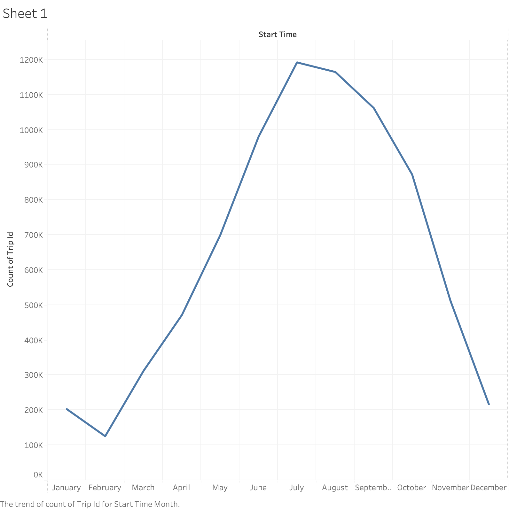

#  Bike Share Toronto 2025 — Ridership Analysis 🚲

An Exploratory Data analysis project examining **7.8 million trips** from Toronto's Bike Share program across 2025. This project covers data integration, cleaning, feature engineering, exploratory analysis, and interactive visualization.

---

## Dashboard Preview



*Monthly ridership peaks in July (~1.19M trips) and drops sharply in winter months, reflecting Toronto's climate-driven cycling patterns.*

---

## Project Structure

```
bike-share-toronto-2025/
│
├── data/
│   └── cleaned_bikeshare_2025.csv       # Cleaned dataset (~7.8M records)
│
├── Bike_Share_TO_2025.ipynb             # Main analysis notebook
├── Bike_share_dashboard_2025.twbx       # Tableau packaged workbook (open in Tableau Desktop/Public)
├── Bike_share_dashboard_2025.png        # Dashboard export preview

```

---

##  Key Findings

| Insight of bike Share Toronto 2025 Rideship | Detail |
|---|---|
| Peak month | July (~1.19M trips) |
| Lowest month | February (~130K trips) |
| Busiest hours | 8–9 AM and 5–6 PM |
| Dominant user type | Annual members |
| Primary trend driver | Seasonal weather patterns |

---

## Methodology

### Data Collection & Integration
- Combined **12 monthly CSV files** into a single dataset using Pandas
- Final dataset: ~**7.8 million trip records**

### Data Cleaning
- Standardized column names (lowercase, stripped whitespace)
- Handled encoding issues and skipped malformed rows
- Converted `start_time` and `end_time` to `datetime` format
- Inspected and documented missing values

### Feature Engineering
New columns extracted from `start_time`:
- `month` (1–12)
- `hour` (0–23)
- `day_of_week` (Monday–Sunday)

### Exploratory Data Analysis

**Seasonal Trends** — Aggregated trips by month to reveal a strong summer peak and winter trough driven by Toronto weather.

**Hourly Usage Patterns** — Trip volume by hour shows two clear commuter spikes: morning (8–9 AM) and evening (5–6 PM), suggesting the system is heavily used for daily commuting.

**User Type Distribution** — Annual members account for the majority of rides, indicating a loyal, habitual user base rather than tourist-driven demand.

---

## Data Visualization

- **Python** (Matplotlib) — used for EDA charts inside the notebook
- **Tableau** — used for the interactive monthly trend dashboard (dashboard exported above)

> To explore the interactive dashboard, open `Bike_share_dashboard_2025.twbx` from my repository. 
---

## Tech Stack

- python, Pandasm Matplotlib, Jupyter Notebook, Tableau

---

## 🔭 What's Next

A few additional things I'd explore in future : 

- **Trip duration patterns** — compare ride lengths between casual and annual members to understand how each group uses the network
- **Predictive modelling** — train a regression model to forecast monthly ridership, which could help the city plan bike availability and rebalancing

---

## 🚀 Getting Started

```bash
# Clone the repo
git clone https://github.com/nidhibswss/bike-share-toronto-2025.git
cd bike-share-toronto-2025

# Install dependencies
pip install pandas matplotlib jupyter

# Launch the notebook
jupyter notebook Bike_Share_TO_2025.ipynb
```

> **Note:** The raw monthly CSVs are not included due to file size. The cleaned dataset (`cleaned_bikeshare_2025.csv`) is available for direct analysis. Raw data can be downloaded from the [City of Toronto Open Data Portal](https://open.toronto.ca/dataset/bike-share-toronto-ridership-data/).

---

## 📌 Data Source

[Bike Share Toronto Ridership Data — City of Toronto Open Data](https://open.toronto.ca/dataset/bike-share-toronto-ridership-data/)

---
